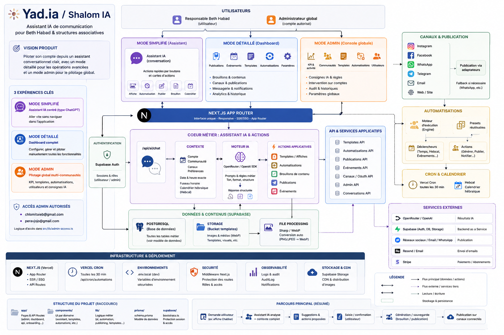
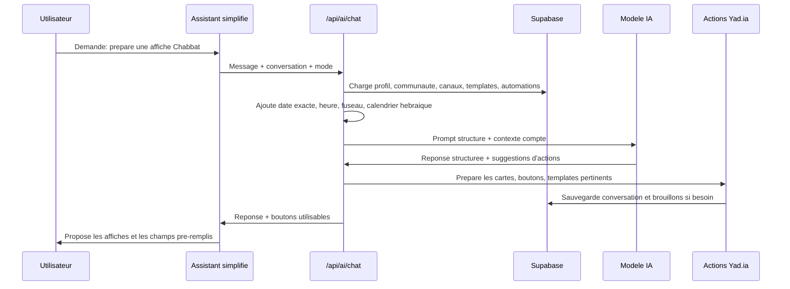

# Yad.ia / Shalom IA

Assistant IA de communication pour Beth Habad, communautés juives et structures associatives. Le produit centralise le contexte de chaque communauté, propose des contenus, prépare des affiches, pilote des automatisations et aide l'utilisateur a publier plus vite sur ses canaux.

L'objectif fonctionnel est simple : l'utilisateur doit pouvoir piloter son compte depuis un assistant conversationnel clair, tout en gardant un mode detaille et un mode admin pour les operations avancees.

## Schema Global

```mermaid
flowchart TB
  User[Utilisateur Beth Habad] --> UI[Next.js App Router]
  Admin[Administrateur global] --> AdminUI[Console admin]

  UI --> Auth[Supabase Auth]
  UI --> Assistant[Assistant IA simplifie / detaille]
  UI --> Dashboard[Pages detaillees]
  AdminUI --> AdminAPI[API admin]

  Assistant --> ChatAPI[/api/ai/chat]
  ChatAPI --> Context[Contexte compte + date + calendrier hebraique]
  ChatAPI --> AI[OpenRouter / OpenAI SDK]
  ChatAPI --> Actions[Actions applicatives]

  Actions --> Templates[Affiches / templates]
  Actions --> Automations[Automatisations]
  Actions --> Drafts[Brouillons de contenu]
  Actions --> Publications[Publications]

  AdminAPI --> Templates
  AdminAPI --> Automations
  AdminAPI --> Communities[Communautes]
  AdminAPI --> Conversations[Conversations]

  Auth --> DB[(Supabase PostgreSQL)]
  Context --> DB
  Templates --> Storage[(Supabase Storage)]
  Templates --> Image[Sharp / WebP]
  Automations --> Cron[Vercel Cron toutes les 30 min]
  Automations --> Hebcal[Hebcal]
  Publications --> Channels[Instagram / Facebook / WhatsApp / Telegram / Email]
  Drafts --> DB
  Conversations --> DB
  Communities --> DB
```

## Maquette de Fonctionnement

Cette maquette sert de reference visuelle pour comprendre l'articulation generale de Shalom IA : assistant central, automatisations, affiches, calendrier, donnees communautaires et pilotage admin.



## Vision Produit

Yad.ia est organise autour de deux experiences principales :

| Mode | Role | Utilisateur cible |
| --- | --- | --- |
| Mode simplifie | Interface type ChatGPT, sans barre laterale applicative, avec l'assistant IA au centre. L'assistant comprend le compte, propose des boutons d'action et applique les changements. | Responsable de Beth Habad qui veut aller vite sans naviguer dans l'application. |
| Mode detaille | Dashboard complet avec pages dediees : publications, evenements, templates, automatisations, parametres, messagerie. | Utilisateur avance ou equipe qui veut tout configurer manuellement. |
| Mode admin | Pilotage global de toutes les communautes, KPI, affiches, automatisations, utilisateurs et consignes IA. | Comptes administrateurs autorises. |

Les comptes admin autorises dans le code sont :

- `chlomitaieb@gmail.com`
- `peravjojo@gmail.com`

La logique d'acces est dans `src/lib/admin-access.ts`.

## Parcours Principal



## Modules Fonctionnels

### Assistant IA

Fichiers principaux :

| Fichier | Role |
| --- | --- |
| `src/components/assistant/assistant-client.tsx` | Interface du chat, mode simplifie, historique, suppression conversations, suggestions, cartes d'action, affiches 3 par 3. |
| `src/app/api/ai/chat/route.ts` | Route principale du chat, raccourcis conversationnels, reponses structurees, actions assistant. |
| `src/lib/ai/engine.ts` | Appel au modele IA et injection du contexte systeme. |
| `src/lib/ai/prompts.ts` | Prompts metier et regles de ton/reponse. |
| `src/lib/ai/time-context.ts` | Date, heure, fuseau, date hebraique, informations calendaires utiles. |

Principes importants :

- Le mode simplifie est l'experience par defaut.
- L'assistant doit repondre de maniere structuree : resume, action recommandee, informations utilisees, elements a confirmer, prochaine etape.
- Les reponses doivent contenir des boutons ou cartes quand une action peut etre appliquee.
- L'assistant doit toujours tenir compte de la date, de l'heure, du fuseau horaire et du calendrier hebraique.

### Affiches et Templates

Fichiers principaux :

| Fichier | Role |
| --- | --- |
| `src/lib/templates/shared.ts` | Selection et scoring des affiches pertinentes. |
| `src/lib/templates/analysis.ts` | Analyse des templates. |
| `src/lib/templates/render.ts` | Preparation/rendu des visuels. |
| `src/app/api/templates/confirm/route.ts` | Confirmation d'une affiche et pre-remplissage avec contexte communaute/calendrier. |
| `src/components/templates/templates-client.tsx` | Interface detaillee des templates. |
| `src/app/api/admin/uploads/template-image/route.ts` | Upload admin, conversion WebP avec Sharp, stockage Supabase Storage. |

Regles de fonctionnement :

- Les affiches doivent etre suggerees selon le theme demande, la categorie, les tags, la sous-categorie et la description.
- En mode assistant, les suggestions d'affiches sont affichees en grille 3 colonnes sur bureau.
- Apres selection d'une affiche, l'application pre-remplit les champs avec les informations connues : Beth Habad, ville, horaires, calendrier, evenement, etc.
- Les images uploadees depuis l'admin sont converties en WebP quand elles sont en PNG/JPEG.
- Le bucket Supabase utilise pour les images de templates est `templates`.

### Automatisations

Fichiers principaux :

| Fichier | Role |
| --- | --- |
| `src/components/automations/automations-client.tsx` | Creation, modification, configuration et declenchement manuel des automatisations. |
| `src/lib/automation/presets.ts` | Presets d'automatisations disponibles et actions associees. |
| `src/lib/automation/engine.ts` | Moteur d'execution des automatisations. |
| `src/lib/automation/hebcal.ts` | Utilitaires calendrier hebraique / Chabbat / fetes. |
| `src/app/api/automations/route.ts` | Creation et listing des automatisations utilisateur. |
| `src/app/api/automations/[id]/route.ts` | Modification/suppression d'une automatisation. |
| `src/app/api/automations/[id]/trigger/route.ts` | Execution manuelle. |
| `src/app/api/cron/automations/route.ts` | Execution periodique par cron. |

Presets actuels :

- Chabbat hebdomadaire.
- Pensee quotidienne.
- Rappel de cours hebdomadaire.
- Message de fete.
- Rappel de don.

Le cron est configure dans `vercel.json` toutes les 30 minutes sur `/api/cron/automations`.

### Mode Admin

Fichiers principaux :

| Fichier | Role |
| --- | --- |
| `src/app/admin/page.tsx` | Page serveur admin, protection d'acces, chargement des donnees globales. |
| `src/components/admin/admin-console-client.tsx` | Interface admin : sidebar, KPI, templates, automatisations, utilisateurs, filtres, theme clair/sombre. |
| `src/app/api/admin/templates/route.ts` | Creation de templates. |
| `src/app/api/admin/templates/[id]/route.ts` | Modification/suppression de templates. |
| `src/app/api/admin/automations/route.ts` | Creation d'automatisations admin pour une communaute. |
| `src/app/api/admin/automations/[id]/route.ts` | Modification/suppression d'automatisations depuis l'admin. |

Capacites admin :

- Voir les KPI globaux : conversations, generations, templates, base de donnees, activite.
- Ajouter, renommer, modifier et supprimer des affiches.
- Ajouter des consignes IA sur les affiches pour guider les suggestions futures.
- Uploader des affiches par URL ou glisser-deposer.
- Creer des automatisations predefinies avec nom, logo et description.
- Voir et filtrer les automatisations par communaute/utilisateur/statut.
- Intervenir sur le compte d'une communaute si besoin.

### Canaux Sociaux et Publication

Fichiers principaux :

| Fichier | Role |
| --- | --- |
| `src/components/settings/channels-settings-client.tsx` | Connexion et statut des reseaux sociaux. |
| `src/app/api/auth/oauth/[provider]/route.ts` | Demarrage OAuth. |
| `src/app/api/auth/oauth/[provider]/callback/route.ts` | Callback OAuth et stockage du canal. |
| `src/lib/publishing/publisher.ts` | Adaptateurs de publication. |
| `src/components/publications/publications-client.tsx` | Gestion des publications. |

Point critique : l'URL OAuth doit correspondre a `NEXT_PUBLIC_APP_URL`. En developpement local, utiliser de preference :

```bash
NEXT_PUBLIC_APP_URL=http://localhost:3000
```

Puis ouvrir l'application via `http://localhost:3000`, pas une autre URL, pour eviter les erreurs de callback OAuth.

## Modele de Donnees

Le schema Prisma est dans `prisma/schema.prisma`. Les tables principales sont :

| Modele | Role |
| --- | --- |
| `User` / `profiles` | Profil lie a Supabase Auth, role et communaute rattachee. |
| `Community` | Source de verite d'un Beth Habad : nom, ville, timezone, ton, regles editoriales, abonnement. |
| `CommunityMember` | Membres/contacts de la communaute. |
| `Channel` | Canaux connectes : Instagram, Facebook, WhatsApp, Telegram, Email, Web. |
| `Event` | Evenements communautaires. |
| `ContentDraft` | Brouillons generes ou prepares. |
| `Template` | Affiches et modeles reutilisables. |
| `Publication` | Publications envoyees ou programmees. |
| `Automation` | Regles d'automatisation. |
| `AutomationRun` | Historique d'execution des automatisations. |
| `MediaFile` | Fichiers media rattaches a la communaute. |
| `AIMemory` | Memoire IA par communaute. |
| `Conversation` | Conversations assistant. |
| `ConversationMessage` | Messages d'une conversation. |
| `Notification` | Notifications internes. |
| `AuditLog` | Traces d'actions importantes. |

## Structure du Projet

```text
src/
  app/
    admin/                  Console admin globale
    api/                    Routes API Next.js
    dashboard/              Mode detaille de l'application
    onboarding/             Parcours initial de configuration
    page.tsx                Page d'entree
  components/
    admin/                  UI admin
    assistant/              Chat IA et assistant simplifie
    automations/            UI automatisations
    content/                Brouillons et contenus
    events/                 Evenements
    layout/                 Sidebar/topbar du mode detaille
    publications/           Publications
    settings/               Parametres, canaux, facturation
    templates/              Affiches/templates
    ui/                     Composants UI generiques
  lib/
    ai/                     Prompts, moteur IA, contexte temps/calendrier
    automation/             Presets, moteur, Hebcal
    publishing/             Publication multicanale
    supabase/               Clients Supabase serveur/client/admin
    templates/              Selection, analyse, rendu des affiches
    admin-access.ts         Regles d'acces admin
    prisma.ts               Client Prisma
  middleware.ts             Protection des routes et session Supabase
prisma/
  schema.prisma             Modele de donnees
supabase/
  bootstrap.sql             Initialisation SQL historique
```

## Routes API Importantes

| Route | Role |
| --- | --- |
| `/api/ai/chat` | Assistant IA conversationnel. |
| `/api/templates/confirm` | Preparation d'une affiche selectionnee. |
| `/api/automations` | Liste/creation automatisations utilisateur. |
| `/api/automations/[id]` | Modification/suppression. |
| `/api/automations/[id]/trigger` | Declenchement manuel. |
| `/api/cron/automations` | Execution periodique. |
| `/api/admin/templates` | Creation admin de templates. |
| `/api/admin/templates/[id]` | Modification/suppression admin de templates. |
| `/api/admin/uploads/template-image` | Upload et conversion WebP. |
| `/api/admin/automations` | Creation admin d'automatisations. |
| `/api/admin/automations/[id]` | Modification/suppression admin d'automatisations. |
| `/api/auth/oauth/[provider]` | Connexion reseaux sociaux. |
| `/api/auth/oauth/[provider]/callback` | Callback reseaux sociaux. |

## Variables d'Environnement

Creer un fichier `.env.local` a la racine. Ne jamais commiter les secrets.

Variables principales :

```bash
# Application
NEXT_PUBLIC_APP_URL=http://localhost:3000
CRON_SECRET=...

# Supabase
NEXT_PUBLIC_SUPABASE_URL=...
NEXT_PUBLIC_SUPABASE_ANON_KEY=...
SUPABASE_SERVICE_ROLE_KEY=...
DATABASE_URL=...
DIRECT_URL=...

# IA
OPENROUTER_API_KEY=...
OPENROUTER_MODEL=...
OPENAI_API_KEY=... # selon les fonctions utilisees

# Reseaux sociaux / OAuth
META_APP_ID=...
META_APP_SECRET=...

# Email / Paiement / Images
RESEND_API_KEY=...
STRIPE_SECRET_KEY=...
NEXT_PUBLIC_STRIPE_PUBLISHABLE_KEY=...
STRIPE_WEBHOOK_SECRET=...
FAL_KEY=...
```

Adapter les noms exacts aux usages presents dans le code et dans `.env.local`.

## Lancement Local

```bash
npm install
npm run dev -- --hostname 127.0.0.1 --port 3000
```

Ouvrir ensuite :

```text
http://localhost:3000
```

Commandes utiles :

```bash
npm run lint
npm run build
npx prisma generate
```

Notes :

- `next.config.ts` ignore actuellement les erreurs TypeScript au build. Ce choix evite de bloquer le developpement, mais les erreurs doivent etre corrigees progressivement.
- Le projet utilise Next.js `16.2.3`. Avant de modifier des conventions Next.js, lire les guides locaux dans `node_modules/next/dist/docs/` comme indique dans `AGENTS.md`.
- Les warnings d'images peuvent apparaitre si des balises `` sont encore utilisees. Ils ne bloquent pas necessairement le build.

## Regles de Developpement

- Ne pas casser le mode simplifie : il doit rester epure, centre sur l'assistant, sans navigation applicative lourde.
- Toute action proposee par l'assistant doit idealement etre executable par bouton, pas seulement par texte.
- Toute reponse IA dependante du temps doit utiliser le contexte date/heure/fuseau/calendrier hebraique.
- Les templates doivent etre renseignes avec des tags, descriptions et consignes IA clairs pour ameliorer la pertinence des suggestions.
- Les automatisations reutilisables doivent etre ajoutees dans `src/lib/automation/presets.ts` pour rester coherentes entre admin, assistant et dashboard.
- Les actions admin doivent verifier `canAccessAdmin` ou un controle equivalent cote serveur.
- Les uploads d'affiches doivent rester centralises via Supabase Storage et conversion WebP.

## Flux Metier a Connaitre

### Preparation d'une affiche

1. L'utilisateur demande une affiche dans l'assistant.
2. L'assistant identifie le theme : Chabbat, fete, cours, don, evenement, etc.
3. Les templates sont scores selon categorie, sous-categorie, tags, description et usage.
4. L'utilisateur choisit une affiche.
5. L'application pre-remplit les champs avec le contexte connu.
6. L'utilisateur valide ou modifie.
7. Le brouillon peut etre genere, sauvegarde puis publie.

### Creation d'une automatisation

1. L'utilisateur demande une automatisation ou clique un preset.
2. L'application cree une `Automation` avec un trigger et des actions.
3. Le moteur peut l'executer manuellement ou via cron.
4. Chaque execution cree un `AutomationRun`.
5. Les erreurs passent l'execution en `FAILED`, les succes en `SUCCESS`.

### Pilotage admin

1. L'admin accede a `/admin` ou au bouton admin dans les parametres.
2. Il consulte les KPI, communautes, conversations, templates et automatisations.
3. Il peut modifier les affiches et ajouter des consignes IA.
4. Il peut creer des automatisations predefinies ou intervenir sur celles d'une communaute.
5. Ces changements deviennent disponibles pour les utilisateurs dans le mode assistant et le mode detaille.

## Contraintes Connues

- WhatsApp peut necessiter une integration Business API complete pour la publication directe. Sinon, l'application doit proposer un fallback utilisable.
- Les connexions Meta/Facebook/Instagram dependent strictement de la configuration OAuth et des URLs de callback.
- Le scoring des affiches depend de la qualite des metadonnees admin. Une affiche mal taggee sera moins bien suggeree.
- Les donnees calendaires doivent toujours etre interpretees avec le fuseau de la communaute, pas seulement celui du serveur.

## But de ce README

Ce fichier sert de carte d'organisation du projet. Avant d'ajouter une fonctionnalite, identifier :

1. Le module concerne : assistant, templates, automatisations, admin, publication, auth.
2. Les fichiers principaux a modifier.
3. Le modele de donnees impacte.
4. Le flux utilisateur attendu.
5. Les controles serveur necessaires.

L'objectif est de garder une architecture lisible : un assistant simple pour l'utilisateur, un dashboard detaille pour les reglages avances, et une console admin pour piloter le systeme global.
